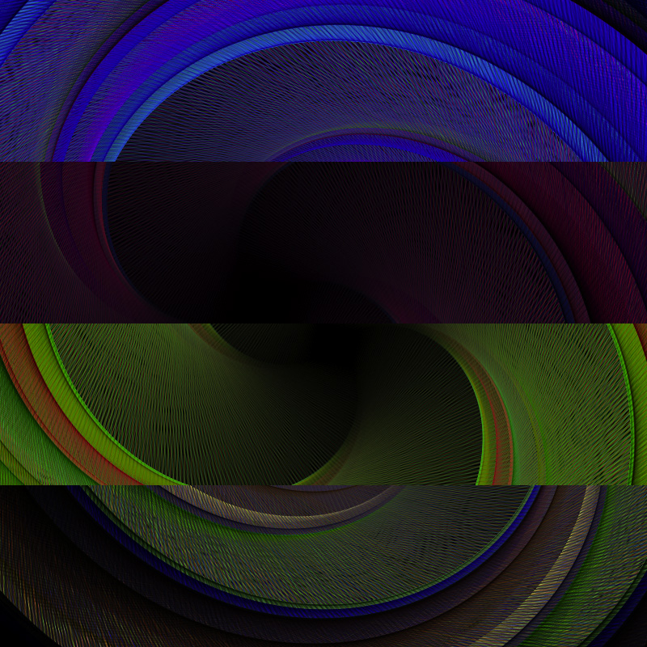

# gskinner labs: Color Swirl
Overdrawing a transforming rectangle, with a multiply effect. The rectangle is rotated and scaled with a Tween on a
non-clearing stage. A little randomness in the color and size gives the overdrawn, 3d effect.

This lab can be viewed at http://labs.gskinner.com/29/color_swirl

##Authors##
 * Lanny McNie
 * Sebastian DeRossi